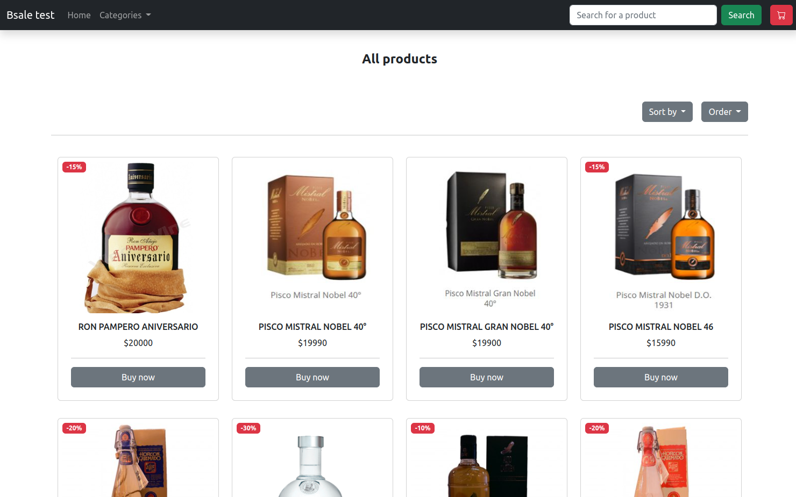
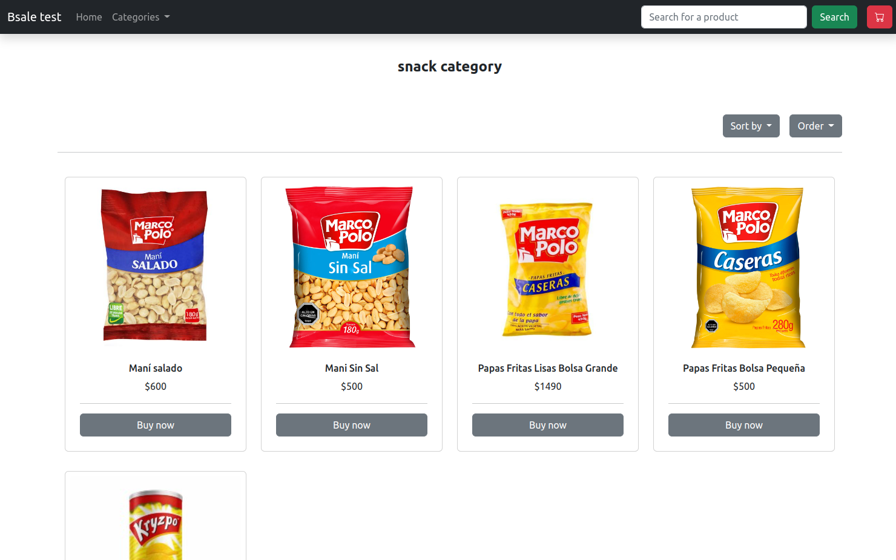
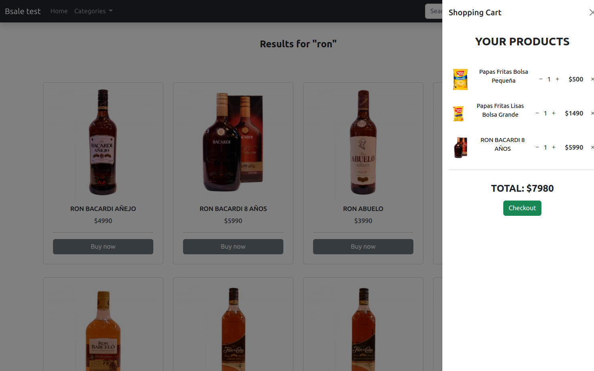
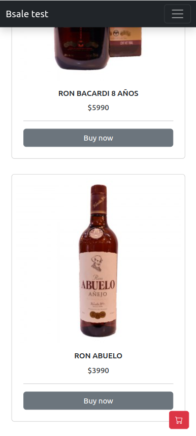
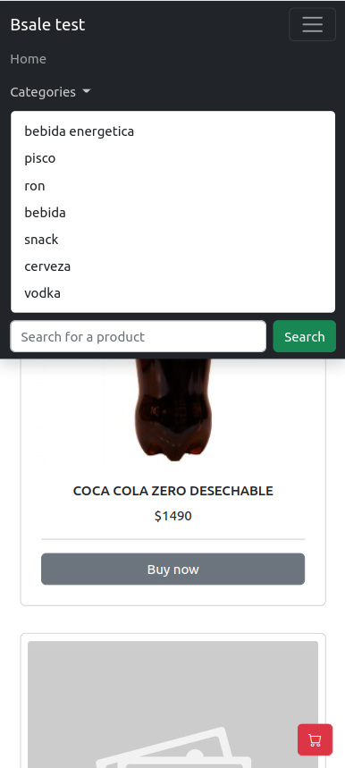

# Bsale front end

Front end application made for the Bsale technical test.

## Deploy

- Deploy (Netlify) ☞ <a href="https://bsale-test-front.netlify.app/">Bsale test Front</a>

## About

This was thought as a fornt end to consume the Bsale-backend API to see, filter and sort product from a MSQL database.

- Back end API (Heroku) ☞ <a href="https://github.com/Ezequiel-CE/bsale-test-back">Bsale Back end repository</a>

## Techs

- [JavaScript](https://developer.mozilla.org/es/docs/Web/JavaScript)
- [WebPack](https://webpack.js.org/)
- [BootStrap](https://getbootstrap.com/)

## Snips

### WEB

### MOVILE

